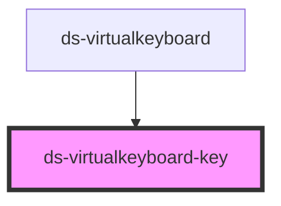

# ds-virtualkeyboard-key

<!-- Auto Generated Below -->

## Properties

| Property              | Attribute     | Description                                                          | Type                                       | Default     |
| --------------------- | ------------- | -------------------------------------------------------------------- | ------------------------------------------ | ----------- |
| `idProp` _(required)_ | `id-prop`     | The `id` of the component                                            | `string`                                   | `undefined` |
| `isActive`            | `is-active`   | The `active` state of the component                                  | `boolean`                                  | `undefined` |
| `isSelected`          | `is-selected` | The `selected` state of the component                                | `boolean`                                  | `undefined` |
| `mode`                | `mode`        | The `Mode` of the component > `lowercase`, `uppercase` or `specials` | `"lowercase" \| "specials" \| "uppercase"` | `undefined` |
| `pressKey`            | --            | A function triggered on `click` event on the component               | `(T: string) => void`                      | `undefined` |
| `sign` _(required)_   | `sign`        | The symbol displayed on the component                                | `string`                                   | `undefined` |
| `special`             | `special`     | TODO                                                                 | `string`                                   | `undefined` |

## Dependencies

### Used by

 - [ds-virtualkeyboard](..)

### Graph

----------------------------------------------

*Built with [StencilJS](https://stenciljs.com/)*
