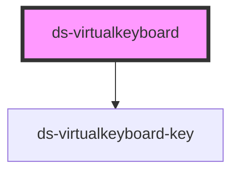

# ds-virtualkeyboard

<!-- Auto Generated Below -->

## Properties

| Property       | Attribute     | Description | Type                                                                        | Default     |
| -------------- | ------------- | ----------- | --------------------------------------------------------------------------- | ----------- |
| `initialState` | --            |             | `{ cursorIndex: number; inputValue: string[]; mode: VirtualKeyboardMode; }` | `undefined` |
| `selectedId`   | `selected-id` |             | `string`                                                                    | `undefined` |

## Events

| Event                       | Description                               | Type                                                                                     |
| --------------------------- | ----------------------------------------- | ---------------------------------------------------------------------------------------- |
| `virtualKeyboardStateEvent` | Emit component's state after each changes | `CustomEvent<{ cursorIndex: number; inputValue: string[]; mode: VirtualKeyboardMode; }>` |

## Dependencies

### Depends on

- [ds-virtualkeyboard-key](ds-virtualkeyboard-key)

### Graph

----------------------------------------------

*Built with [StencilJS](https://stenciljs.com/)*
